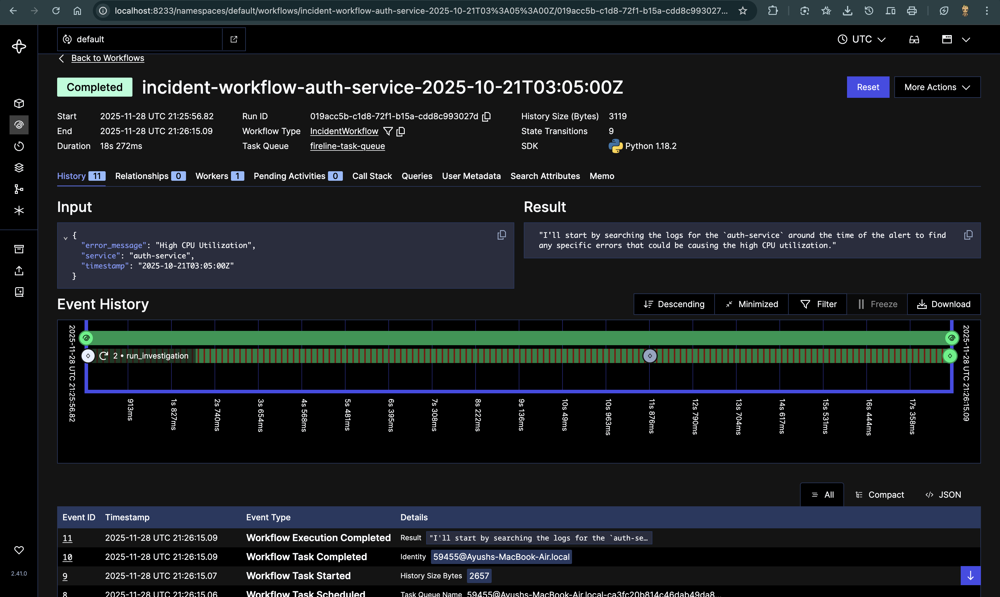
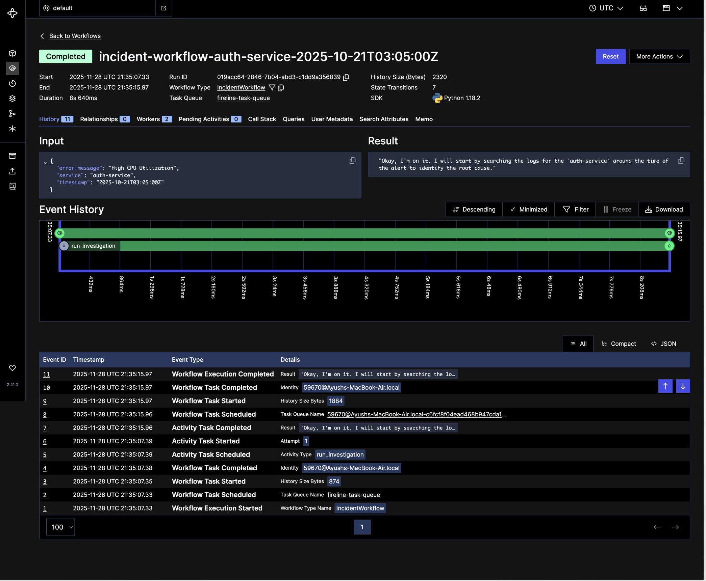
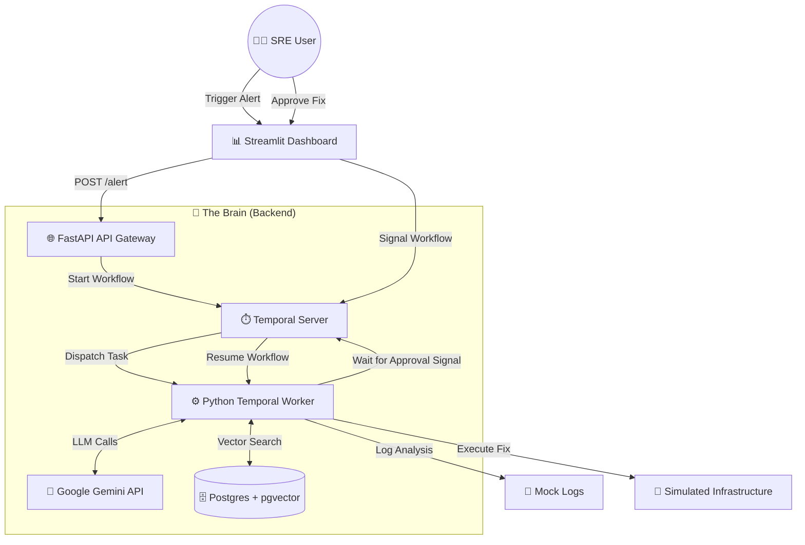

<div align="center">


# 🔥 Fireline: Autonomous SRE Incident Commander


<!-- Tech Stack Badges -->


<!-- Deployment Badges -->
<br/>
<a href="https://fireline-poc.streamlit.app" target="_blank">
  
</a>
<a href="https://fireline-backend.onrender.com/docs" target="_blank">
  
</a>

<br/>
<br/>

**🤖 An event-driven AI Agent that acts as a Level 1 Site Reliability Engineer.**  
*It monitors, investigates, fixes, and—most importantly—asks for permission.*

[🎥 View Demo](#-demo) • [🏗 Architecture](#-system-architecture) • [🚀 Quick Start](#-setup--installation) • [📚 Research](#-research--conceptual-foundations)


</div>

---

## 🧐 What is Fireline?

**Fireline** is not just a chatbot; it is a **Durable, Autonomous Agent** designed for production infrastructure.

Unlike standard scripts that break when servers crash, Fireline uses **Temporal.io** to maintain state through failures. It combines **Google Gemini Pro** for reasoning with **Vector Search (RAG)** to ground its decisions in your actual runbooks, ensuring it investigates incidents exactly how a human SRE would—but faster.

<div align="center">
  
</div>

### ✨ Core Capabilities

| Feature | Description | Tech Stack |
| :--- | :--- | :--- |
| **🛡️ Durable Execution** | If the agent crashes mid-debug, it wakes up and resumes exactly where it left off. | `Temporal.io` |
| **🧠 Agentic RAG** | Consults internal documentation (Postgres) before proposing fixes to prevent hallucinations. | `pgvector` + `Gemini` |
| **🚦 Human-in-the-Loop** | **Safety First.** The agent executes reads autonomously but waits for a "Go" signal for writes. | `Temporal Signals` |
| **🕵️ Semantic Investigation** | Understands that "OOMKilled" implies "Memory Pressure" without exact keyword matching. | `text-embedding-004` |

---

## 🎥 Demo

<div align="center">
  
  
  > *👀 Watch: The agent autonomously detects a CPU spike, searches logs, retrieves the correct runbook, and pauses for human approval.*
</div>

### 📊 The Dashboard Experience

<div align="center">
<table>
  <tr>
    <td align="center"><b>🕵️ **Incident Details</b></td>
    <td align="center"><b>✅ **AI Analysis**</b></td>
  </tr>
  <tr>
    <td></td>
    <td></td>
  </tr>
</table>
</div>

---

## 🧠 The Architecture: Why this Stack?

We solve the three biggest problems in AI Ops: **Memory Loss**, **Hallucinations**, and **Safety**.

### 1. The "Amnesia" Problem 🛑
*   ❌ **Standard AI:** A python script crashes while parsing a 10GB log file. Context is lost.
*   ✅ **Fireline:** Uses **Temporal Workflows**. The state is persisted in a database. If the worker dies, it respawns and continues from line 42.

### 2. The "Hallucination" Problem 😵‍💫
*   ❌ **Standard AI:** LLMs invent imaginary `kubectl` flags.
*   ✅ **Fireline:** Implements **RAG (Retrieval-Augmented Generation)**. The AI is forced to cite a Markdown Runbook from the Vector DB before acting.

### 3. The "Skynet" Problem 🤖
*   ❌ **Standard AI:** AI executes `DROP DATABASE`.
*   ✅ **Fireline:** Implements **Signal-Gating**. The workflow pauses indefinitely at critical junctions, waiting for a cryptographic signature/API signal from a human.


## 📚 Table of Contents

1. [Motivation & Key Ideas](#-motivation--key-ideas)  
2. [System Architecture](#-system-architecture)  
3. [Incident Lifecycle](#-incident-lifecycle)  
4. [Tech Stack](#-tech-stack)  
5. [Getting Started (Local)](#-getting-started-local)  
   - [Prerequisites](#-prerequisites)  
   - [Infrastructure Setup](#-infrastructure-setup)  
   - [Application Setup](#-application-setup)  
   - [Environment Variables](#-environment-variables)  
   - [Ingesting the Knowledge Base](#-ingesting-the-knowledge-base)  
   - [Running the System](#-running-the-system)  
6. [Usage Walkthrough](#-usage-walkthrough)  
7. [Project Structure](#-project-structure)  
8. [Safety Model: Human-in-the-Loop](#-safety-model-human-in-the-loop)  
9. [Extensibility & Customization](#-extensibility--customization)  
10. [Research & References](#-research--references)  
11. [Author](#-author)  

---

## 🧠 Motivation & Key Ideas

Most AI “agents” in ops are:

- ❌ **Brittle** – If the process dies, the incident state is gone.  
- ❌ **Stateless** – “Memory” is just a prompt; nothing is durably tracked.  
- ❌ **Risky** – Agents can run shell / cloud commands with no real safety layer.  

**Fireline** is designed to feel like a junior SRE on your team:

### 1. ⏱️ Durable Execution with Temporal

**Problem:** Long‑running incident investigations (with multiple tools, backoffs, and waits) are fragile as simple scripts.

**Solution – Temporal Workflows:**

- Each incident = one **Temporal workflow**.
- Workflow state is **persisted**; if a worker dies, Temporal **replays** from the last event.
- No manual checkpointing, yet you get:
  - Transparent retries  
  - Timeouts and backoff  
  - Deterministic, auditable incident flows  

🧩 This aligns with research on **autonomous tool‑using agents** (e.g., *ReAct*, *Toolformer*, *Reflexion* – see [References](#-research--references)) but grounded in production‑grade workflow orchestration.

---

### 2. 📚 Agentic RAG over Internal Runbooks

**Problem:** LLMs hallucinate, especially when asked for remediation steps in infra.

**Solution – Runbook‑grounded RAG:**

- All operational knowledge lives in `knowledge/runbook.md`.
- `src/ingest.py`:
  - Splits runbooks into chunks.
  - Embeds using **Google `text-embedding-004`**.
  - Stores vectors in **Postgres + pgvector**.
- During an incident:
  - The agent embeds the incident context + logs.
  - Performs **semantic search** over runbooks.
  - Generates remediation steps **only when relevant runbooks are found**.

📎 This follows the pattern of **Retrieval-Augmented Generation (RAG)** from *Lewis et al., 2020*.

---

### 3. 🧯 Human-in-the-Loop Safety Gate

**Problem:** You never want an LLM to autonomously run `kubectl delete` or `terraform destroy` in prod.

**Solution – Explicit Temporal Signal Gate:**

- Workflow has a dedicated **“WAIT_FOR_APPROVAL”** state.
- Once a remediation plan is ready, it:
  - Stores reasoning + plan.
  - **Pauses indefinitely**, waiting for a Temporal **signal**.
- The only way to send that signal is:
  - Via authenticated API in `main.py`,
  - Which the **Streamlit dashboard** calls after a human clicks **Approve**.

🔐 This is inspired by **Human‑in‑the‑Loop (HITL) control** and **RL from human feedback** patterns, used to keep agents aligned while still being useful.

---

## 🏗️ System Architecture

<p align="center">
  <!-- If you want, replace this placeholder with a "system design / architecture" GIF from the GIF repo -->
  
</p>

At a glance:

- 🎛️ **Dashboard (Streamlit)** – SRE UI for incidents and approvals.  
- 🌐 **API Gateway (FastAPI)** – Alert ingestion & workflow control.  
- ⚙️ **Temporal Worker** – Runs incident workflows and activities.  
- 🗂️ **Data Layer** – Postgres + pgvector knowledge base.  



---

## 🔄 Incident Lifecycle

📦 **End‑to‑End Flow for a Single Incident:**

1. **Alert → Workflow Start**
   - Dashboard (or external system) sends an alert to **FastAPI**.
   - FastAPI creates a new **Temporal workflow** (incident instance).

2. **Initial Triage**
   - Workflow logs incident metadata:
     - Service (e.g., `auth-service`)
     - Symptom (e.g., `High CPU`)
     - Severity / timestamp  
   - Calls an AI activity to summarize initial context.

3. **Log Investigation 🔍**
   - Worker runs a **log search** tool (mocked in this POC):
     - Fetches relevant log lines for the affected service.
     - Extracts stack traces, errors, and metrics patterns.
   - Gemini interprets logs and crafts a human‑readable explanation.

4. **Runbook Retrieval via RAG 📚**
   - Incident context + extracted signals are embedded.
   - A **pgvector** query finds the nearest runbook items.
   - Gemini combines:
     - Logs
     - Runbook steps  
   - …to propose:
     - Probable root cause
     - Step‑by‑step remediation plan

5. **Pause for Human Approval ⏸️**
   - Workflow stores proposed actions.
   - Reaches a `wait_for_signal` step:
     - Temporal persists this state.
     - Workflow sleeps until it receives a **signal** (approval).

6. **Dashboard Review 👀**
   - SRE visits the dashboard (or live Streamlit app):  
     - Sees incident details + AI reasoning.
     - Reviews proposed remediation.
   - If acceptable, clicks **✅ Approve Fix**.

7. **Approval Signal → Execution ▶️**
   - Dashboard calls FastAPI.
   - FastAPI sends a **Temporal signal** to the workflow.
   - Workflow wakes up and:
     - Executes remediation (simulated infra operations in this POC).
     - Updates incident status to “Resolved”.

8. **Resolution & (Optional) Notifications 📣**
   - Incident is closed in workflow state.
   - `notifications.py` can dispatch notifications (e.g., Slack).
   - Future: auto‑generate post‑mortems.

---

## 🧰 Tech Stack

- ⏱️ **Orchestration:** [Temporal.io](https://temporal.io/) (Python SDK)  
- 🌐 **API:** [FastAPI](https://fastapi.tiangolo.com/)  
- 📊 **Frontend:** [Streamlit](https://streamlit.io/)  
- 🤖 **LLM + Embeddings:** [Google Gemini](https://ai.google.dev/) via Google AI Studio  
- 🗄️ **Database:** PostgreSQL 17 + [pgvector](https://github.com/pgvector/pgvector)  
- 🐍 **Language:** Python 3.10+ (tested with 3.13)  
- 📣 **Notifications:** Slack (webhook) – optional  

---

## 🚀 Getting Started (Local)

<p align="center">
  <!-- You can replace this with a rocket / startup GIF from the GIF repo -->
  
</p>

> 💡 If you just want to **see it in action** without local setup, use the live app:  
> **https://fireline-poc.streamlit.app**  
> And the backend docs:  
> **https://fireline-backend.onrender.com/docs**

### ✅ Prerequisites

- macOS (or Linux with equivalent tooling)  
- **Python 3.10+**  
- **Homebrew** (for macOS installs)  
- **Google AI Studio API Key**  
- `git` (to clone the repository)  

---

### 🧱 Infrastructure Setup

Install Temporal and Postgres with pgvector:

```bash
# 1. Install Temporal (macOS / Homebrew)
brew install temporal

# 2. Install Postgres 17 and pgvector extension
brew install postgresql@17 pgvector
brew services start postgresql@17

# 3. Configure Database
# (Add Postgres to PATH on macOS if needed)
# export PATH="/opt/homebrew/opt/postgresql@17/bin:$PATH"

createdb fireline
psql fireline -c "CREATE EXTENSION vector;"
```

---

### 📦 Application Setup

```bash
# 1. Clone repository
git clone https://github.com/Ayush1Deshmukh/FIRLINE_POC.git
cd FIRLINE_POC

# 2. Create and activate a virtual environment
python3 -m venv venv
source venv/bin/activate

# 3. Install dependencies
pip install -r requirements.txt

# 4. Create an environment file
touch .env
```

---

### 🔑 Environment Variables

Add the following to `.env`:

```ini
GOOGLE_API_KEY="your_google_api_key_here"
SLACK_WEBHOOK_URL="optional_slack_webhook_url"
```

- `GOOGLE_API_KEY` – **required** for Gemini (LLM + embeddings).  
- `SLACK_WEBHOOK_URL` – optional; used for Slack notifications.  

---

### 🧠 Ingesting the Knowledge Base

Populate the vector store with runbooks:

```bash
python src/ingest.py
```

Expected output:

```text
--- 🎉 Success! The Brain is populated. ---
```

If not, ensure:

- Postgres is running.  
- Database `fireline` exists.  
- `CREATE EXTENSION vector;` was run.  

---

### 🕹️ Running the System

Use **4 terminals**:

#### 1️⃣ Temporal Server (Orchestrator)

```bash
temporal server start-dev
```

- Runs Temporal in dev mode.  
- Default Web UI: `http://localhost:8233`.  

#### 2️⃣ Temporal Worker (AI Agent)

```bash
source venv/bin/activate
python worker.py
```

- Registers worker with Temporal.  
- Executes workflows and activities.  

#### 3️⃣ FastAPI Gateway (Backend API)

```bash
source venv/bin/activate
uvicorn main:app --reload
```

- REST endpoints for:
  - Triggering incidents  
  - Checking status  
  - Approving remediation  

Docs (local): `http://127.0.0.1:8000/docs`.  
Hosted (Render): `https://fireline-backend.onrender.com/docs`.

#### 4️⃣ Streamlit Dashboard (Frontend)

```bash
source venv/bin/activate
streamlit run dashboard.py
```

- UI at: `http://localhost:8501`.  
- Hosted UI: `https://fireline-poc.streamlit.app`.

---

## 🧪 Usage Walkthrough

1. **Open the Dashboard**  
   - Local: `http://localhost:8501`  
   - Or Hosted: `https://fireline-poc.streamlit.app`

2. **Trigger an Incident**
   - In the sidebar:
     - Select service (e.g., `auth-service`).
     - Select incident type (e.g., `High CPU`).
   - Click **Trigger**.  
   - A new Temporal workflow is started via FastAPI (local or hosted backend).

3. **Watch the Investigation**
   - In the worker terminal (local) or backend logs (hosted), you’ll see:
     - Log analysis calls (e.g., `search_logs`).  
     - RAG calls (e.g., `search_runbooks`).  
     - Gemini reasoning outputs.  
   - Eventually:
     ```text
     --- ✋ Remediation found. WAITING FOR HUMAN APPROVAL... ---
     ```

4. **Review Proposed Fix**
   - On the dashboard, click **Refresh Status**.
   - You’ll see:
     - Summary of incident  
     - Root cause hypothesis  
     - Runbook‑backed remediation steps  

5. **Approve Remediation**
   - Click **✅ Approve Fix**.
   - Dashboard calls FastAPI → sends Temporal **signal** to the workflow.

6. **Execution & Resolution**
   - Workflow resumes and runs the remediation (simulated infra ops).
   - Incident is marked resolved; optional Slack notification can be sent.

---

## 📂 Project Structure

```text
fireline-poc/
├── src/
│   ├── activities.py      # "Muscle": tools, AI calls, remediation logic, notifications
│   ├── workflows.py       # "Brain": Temporal workflow definitions (incident state machine)
│   ├── tools.py           # Log search & vector search implementations
│   ├── ingest.py          # Embeds markdown runbooks into Postgres (pgvector)
│   └── notifications.py   # Slack (and future) notification integrations
├── knowledge/
│   └── runbook.md         # Source of truth for RAG (operational runbooks)
├── assets/                # Images and GIFs for README / dashboard
├── main.py                # FastAPI backend ("front door" for alerts & approvals)
├── worker.py              # Temporal worker entrypoint
├── dashboard.py           # Streamlit dashboard (SRE control panel)
└── requirements.txt       # Python dependencies
```

---

## 🛡️ Safety Model: Human-in-the-Loop

Fireline is **explicitly** designed to prevent “run‑wild” AI behavior.

- 🔒 All infra actions are encapsulated in dedicated **activities**.  
- ⏸️ Temporal workflow **must** receive an approval **signal** before calling those activities.  
- 👩‍💻 Signals are only emitted by:
  - FastAPI endpoints,  
  - Triggered via the authenticated dashboard.  

This makes Fireline suitable for:

- Direct use in **staging / pre‑prod**.  
- Gradual rollout to **production** with audit trails and access control.  

---

## 🧩 Extensibility & Customization

Treat Fireline as a **template** for your own autonomous SRE agent.

### 📚 Add / Update Runbooks

1. Edit `knowledge/runbook.md` or add more markdown files.  
2. Re‑ingest:

   ```bash
   python src/ingest.py
   ```

3. New knowledge becomes available to RAG.

### 📜 Plug in Real Log Systems

Replace mock log search in `tools.py` / `activities.py` with:

- 🔎 ElasticSearch / OpenSearch  
- 📈 Loki / Grafana  
- ☁️ CloudWatch, Stackdriver, etc.  

Workflow logic remains the same.

### ☸️ Real Infrastructure Actions

Swap simulated operations with real ones:

- `kubernetes` Python client for:
  - Pod restarts
  - Deployment rollouts  
- Terraform Cloud / AWS / GCP SDK calls  
- Any infra tool wrapped as an **activity**  

Keep all infra actions behind the same **approval signal** for safety.

### 📣 More Notification Channels

Extend `notifications.py` to support:

- Email  
- PagerDuty / Opsgenie  
- MS Teams / richer Slack apps  

Hook them into workflow events (incident opened, escalated, resolved).

---

## 📖 Research & References

Fireline is inspired by research on **tool‑using LLM agents**, **RAG**, and **SRE best practices**:

### 🤖 Tool-Using & Autonomous Agents

- **ReAct: Synergizing Reasoning and Acting in Language Models**  
  *Shunyu Yao et al., ICLR 2023.*  
  <https://arxiv.org/abs/2210.03629>

- **Toolformer: Language Models Can Teach Themselves to Use Tools**  
  *Timo Schick et al., NeurIPS 2023.*  
  <https://arxiv.org/abs/2302.04761>

- **Reflexion: Language Agents with Verbal Reinforcement Learning**  
  *Noah Shinn et al., 2023.*  
  <https://arxiv.org/abs/2303.11366>

### 📚 Retrieval-Augmented Generation (RAG)

- **Retrieval-Augmented Generation for Knowledge-Intensive NLP Tasks**  
  *Patrick Lewis et al., NeurIPS 2020.*  
  <https://arxiv.org/abs/2005.11401>

### 🧯 SRE, Reliability & Ops

- **Site Reliability Engineering: How Google Runs Production Systems**  
  *Betsy Beyer, Chris Jones, Jennifer Petoff, Niall Murphy (eds.), O’Reilly, 2016.*  
  <https://sre.google/sre-book/table-of-contents/>

- **The Site Reliability Workbook: Practical Ways to Implement SRE**  
  *Betsy Beyer et al., O’Reilly, 2018.*  
  <https://sre.google/workbook/table-of-contents/>

### 👩‍💻 Human-in-the-Loop & Alignment

- **Deep Reinforcement Learning from Human Preferences**  
  *Paul F. Christiano et al., NeurIPS 2017.*  
  <https://arxiv.org/abs/1706.03741>

- **The Challenge of Crafting Intelligible Intelligence**  
  *Daniel S. Weld and Gagan Bansal, CACM 2019.*  
  <https://dl.acm.org/doi/10.1145/3282486>

These works motivated:

- The **tool‑driven design** of the agent (logs, runbooks, infra actions),  
- The **RAG‑first** approach to avoid hallucinated fixes,  
- The **HITL approval gate** to keep operations safe.  

---

## 👨‍💻 Author

Built by **[Ayush Anil Deshmukh](https://github.com/Ayush1Deshmukh)**.  

Issues, suggestions, and PRs are very welcome if you want to:

- Add real‑world log integrations  
- Wire up Kubernetes / cloud actions  
- Improve the dashboard UX  
- Experiment with different LLMs or RAG setups  

---
